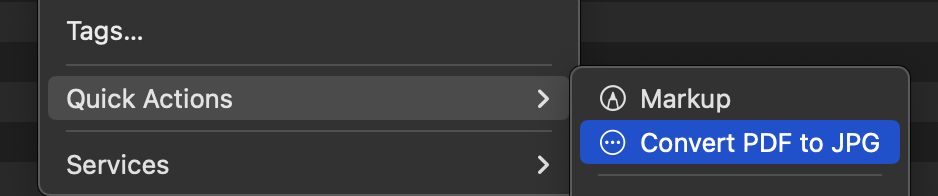
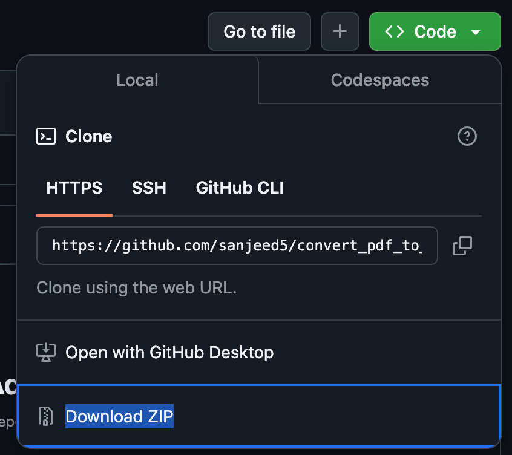

# Convert PDF to JPG Automator Workflow

This Mac Automator workflow makes it super easy to convert PDF files to JPG images. Give it a try and keep your files safe!

## How To Install

1. **Download and Unzip:**  
   - Download the folder from [here](https://github.com/sanjeed5/convert_pdf_to_jpg_on_mac/archive/refs/heads/main.zip) or click the green button "Code" and then "Download ZIP".
     - 
   - Double click the downloaded file and unzip it.

2. **Install the Workflow:**  
   - Simply double-click the unzipped folder. Your Mac will prompt you to install the workflow automatically.

3. **Using the Workflow:**  
   - Open Finder and right-click (or Control-click) on any PDF file.
   - Select the **"Convert PDF to JPG"** service from the Quick Actions menu.
   - The workflow will convert the PDF file into a JPG image and save it in the same directory.

## What's Inside?

- **Convert PDF to JPG.workflow:**  
  Contains the Automator workflow that runs a shell script. This script leverages macOS’s built-in `sips` tool to convert your PDFs to JPGs.

## Requirements

- **macOS:** This workflow works on modern versions of macOS (tested on macOS Catalina and later).
- **Automator & sips Tool:** Both come pre-installed with macOS.

## Troubleshooting

- If the service doesn't appear immediately after installation, try restarting Finder or logging out and back in.

## Contributing

Contributions are welcome! If you have ideas to improve the workflow or find any issues, please:
- Fork the repository.
- Create a feature branch.
- Commit your changes.
- Submit a pull request.

## License

This project is open-sourced under the [MIT License](LICENSE).

Happy converting!
